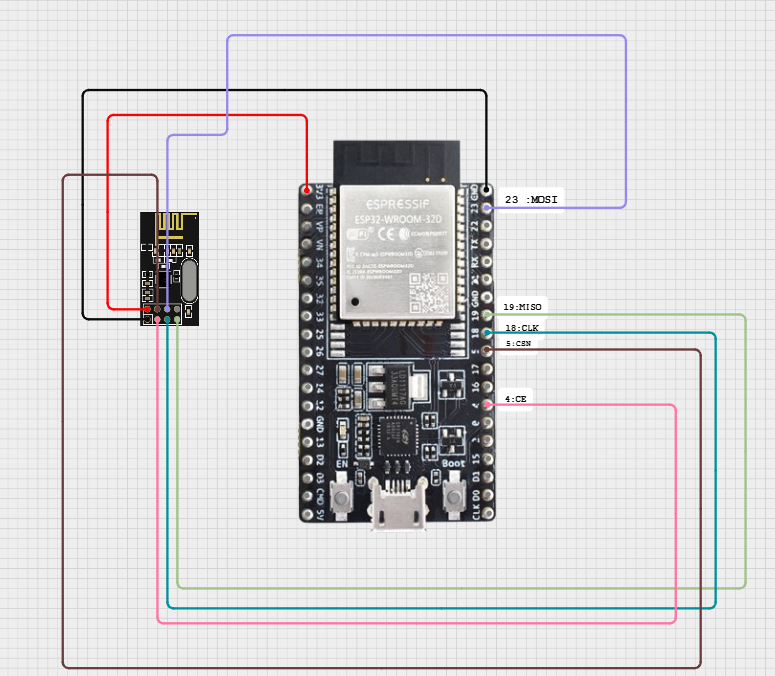

## Communication entre deux NRF24L01 

**Introduction :**  

Ce petit projet documente la communication sans fil entre une commande de drone utilisant un ESP32 et un module NRF24L01, et un drone contrôlé par un ESP32 avec un autre module NRF24L01. L'objectif est d'assurer une transmission fiable des commandes depuis la télécommande vers le drone en utilisant le protocole RF24 et SPI .

**Matériels Utilisés:** 

-2 x NRF24L01
-Joystick de la carte SM-217-BKT V5
-ESP32 (tr) + ESP32 (re)
-NRF24L01

**Schéma de Connexion** : 

| NRF24L01  | ESP32 (Émetteur & Récepteur) |
|-----------|------------------------------|
| VCC       | 3.3V                         |
| GND       | GND                          |
| CE        | GPIO4                        |
| CSN       | GPIO5                        |
| SCK       | GPIO18                        |
| MOSI      | GPIO23                        |
| MISO      | GPIO19                        |

